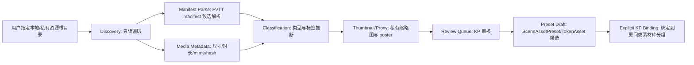

# FVTT/Roll20 资源包导入研究

## 结论摘要

用户已有大量 FVTT/Roll20 地图和 Token 资源包，应先做本地私有素材库，而不是直接上传到公网静态目录。导入器第一阶段只做扫描、分类、缩略图、索引和场景预设草稿。

这份报告只定义私有、只读的导入/索引边界，不实现导入器，也不复制第三方商业资源。商业资源默认保留在用户本机或私有存储中；系统只保存可追溯的索引、缩略图/代理图、媒体元数据、标签和 KP 可审核的绑定草稿。

## 研究范围与证据

- 本次 DND5E 系统克隆位于 `.codex-run/vtt-research/dnd5e`，当前提交为 `42f5b20`。
- 该树顶层包含 `.github`、`fonts`、`icons`、`json`、`lang`、`less`、`module`、`packs`、`templates`、`tokens`、`ui`、`utils` 等目录；文件计数约为 `6637`，其中 `packs` 约 `4862` 个文件、`tokens` 约 `662` 个文件、`icons` 约 `190` 个文件。
- 本次只检查了 DND5E 的 `system.json` 作为 Foundry system manifest 样本；不能把它等同于所有 FVTT module/world manifest 的完整字段集合。
- Roll20 资源包在本阶段不声明存在标准化 folder/package manifest。除非拿到用户的实际样本包并验证其结构，否则只按“用户提供的目录 + 文件名/目录名约定”处理。

## 支持的资源类型

| 类型 | 扩展名 | 建议分类 |
| --- | --- | --- |
| 静态地图 | `.png`, `.jpg`, `.jpeg`, `.webp`, `.avif` | `scene-map`, `battle-map`, `handout` |
| 动态地图 | `.webm`, `.mp4`, `.mov` | `ambient-video`, `animated-map` |
| Token | `.png`, `.webp`, `.gif`, `.webm` | `character-token`, `npc-token`, `monster-token` |
| 图标 | `.svg`, `.png`, `.webp` | `item-icon`, `skill-icon`, `status-icon` |
| FVTT manifest | `module.json`, `system.json`, `world.json` | `foundry-package` |
| Roll20 资源包 | folder + filename conventions | `roll20-pack` |

### 格式支持等级

- `.png`、`.jpg`、`.jpeg`、`.webp`：可作为第一阶段主要预览格式，读取尺寸、hash、缩略图。
- `.avif`：可索引并尝试生成缩略图；浏览器兼容性和服务端图像库支持需在实现时单独确认。
- `.webm`、`.mp4`：可索引为动态地图或动态 token；预览应走私有代理，支持 range request，必要时生成静态 poster。
- `.mov`：先按“可索引、需转码/代理”的资源处理，不承诺浏览器直接播放。第一阶段可以记录 metadata 和 poster，不要求转换原文件。
- `.gif`：可索引为动态 token，但移动端和低性能设备应允许退回第一帧 poster。
- `.svg`：只作为图标候选进入索引；直接渲染前必须净化或栅格化，避免脚本、外链、事件属性和嵌入内容风险。
- 压缩包：不属于第一阶段默认扫描目标。除非用户明确要求并进入隔离目录，否则不自动解压，也不让压缩包内容参与正常索引。

## 建议的 Asset

```typescript
export interface ImportedAsset {
  id: string;
  title: string;
  type: 'image' | 'video' | 'audio' | 'icon' | 'manifest';
  subtype: string;
  sourcePath: string;
  privateUrl?: string;
  thumbnailPath?: string;
  width?: number;
  height?: number;
  durationMs?: number;
  isAnimated: boolean;
  sourcePackId?: string;
  tags: string[];
  licenseNote: string;
}
```

### 字段语义

- `id`：索引内的稳定 id，可由 pack id、相对路径和内容 hash 派生；不应暴露真实本机绝对路径。
- `title`：展示名，优先来自 manifest label、文件名清洗结果或目录上下文。
- `type`：媒体大类。`manifest` 只代表 package/pack 元数据文件本身，不代表已经完成资产归一化。
- `subtype`：业务分类，例如 `scene-map`、`animated-map`、`character-token`、`status-icon`。
- `sourcePath`：原始来源路径，必须保留用于本地追溯；对外接口返回时应脱敏或仅在 KP/管理员私有界面展示。
- `privateUrl`：登录后私有代理 URL，不是公网静态 URL。
- `thumbnailPath`：索引生成的缩略图或 poster 路径，应放在私有缓存区，不放在 `apps/web/public`。
- `sourcePackId`：来自 FVTT/Roll20/本地素材包时填写，用于追溯包来源和批量管理。
- `licenseNote`：只记录用户私有使用、来源备注或需要复核的信息；导入器不做版权判断，也不把记录视为授权结论。

## 私有访问原则

- 商业资源默认不放进 `apps/web/public`。
- 本地扫描结果先进入私有索引，不生成公网 URL。
- 服务器部署时必须走登录后鉴权访问，避免裸露付费资源。
- 导入器保留 `sourcePath` 和 `sourcePackId`，方便用户追溯来源。

补充原则：

- 私有代理必须复用房间/素材库鉴权；前端隐藏按钮不是权限边界。
- 缩略图、poster、转码代理同样按商业资源处理，不因“派生文件”而默认公开。
- 房间运行时只绑定 `ImportedAsset.id` 或更上层的 `TokenAsset` / `SceneAssetPreset`，不直接绑定用户本机路径。
- KP 明确选择并绑定前，任何扫描结果都不进入房间、调查对象或公开模板市场。

## 第一阶段导入器边界

- 只读扫描，不移动源文件。
- 生成缩略图和 manifest 草稿。
- 按文件名、目录名、manifest 元数据推断标签。
- 不做版权判断，只记录来源和用户私有标记。
- 不自动公开到房间，必须由 KP 手动选择绑定。

第一阶段可以做：

1. 发现用户指定的资源根目录。
2. 识别 FVTT `module.json`、`system.json`、`world.json` 和普通媒体文件。
3. 解析可安全读取的 JSON manifest，生成 `sourcePackId`、包名、版本、pack 声明和来源备注。
4. 读取图片/视频基础 metadata：尺寸、时长、mime、文件大小、内容 hash。
5. 按目录名、文件名、manifest pack label、Foundry `flags` 中的非敏感分类信息推断 tags。
6. 生成私有缩略图、poster 或轻量代理记录。
7. 把疑似地图、动态图、token、图标放入 KP review queue。
8. 为地图类资产草拟 `SceneAssetPreset`，为 token 类资产草拟 `TokenAsset` 候选。
9. 等 KP 明确确认后，再把候选绑定到房间或素材库分组。

第一阶段明确不做：

- 不移动、改名、覆盖或删除源文件。
- 不把商业资源复制到 `apps/web/public`。
- 不自动发布到房间、调查场景、角色档案或公开页面。
- 不抓取远程 URL，除非用户在后续阶段显式允许并配置下载隔离策略。
- 不自动解压归档包，不执行包内脚本，不加载第三方代码。
- 不解析 Roll20 私有导出格式或专有包结构，直到实际样本经过审查。

## Foundry Manifest 能告诉我们什么

DND5E `system.json` 证明 Foundry package manifest 至少可以提供以下线索：

- package 身份和展示信息：`id`、`title`、`description`、`version`。
- Foundry 兼容性：`compatibility.minimum`、`compatibility.verified`。
- 上游地址：`url`、`manifest`、`download`。
- 入口资源：`esmodules`、`styles`。
- 文档类型声明：如 `Actor`、`Item`、`JournalEntryPage` 的 subtype、`htmlFields`、`filePathFields`。
- compendium pack 声明：`packs[]` 中的 `name`、`label`、`system`、`path`、`type`、`private`、`ownership`、`flags`。
- pack 文件夹分组：`packFolders[]` 说明 UI/内容分组，不等于文件系统目录的完整语义。
- media/setup 资源：`media[]` 可给出 setup 图、thumbnail 等展示素材。
- system 级配置和 flags：如 grid、token attribute、背景图、compendium art mapping。

这些字段适合用于“发现包、识别 pack、生成来源和初步标签”。例如 DND5E manifest 中 `packs[]` 声明了 `heroes`、`monsters`、`items`、`spells` 等 23 个 pack；每个 pack 给出 `path` 和 Foundry 文档 `type`，部分 pack 的 `flags.dnd5e.types` 能提示 `npc`、`spell`、`weapon` 等语义。

## Foundry Manifest 不能替我们决定什么

Foundry manifest 是 package 元数据和 compendium pack 声明，不是自动完成的、标准化的素材目录。它不能保证：

- 包内所有图片、视频、音频和 token 都已列成可直接复用资产。
- `path` 指向的 pack 内容一定是通用媒体资产；它可能是 Actor、Item、JournalEntry、RollTable 等 Foundry 文档。
- `flags` 是跨系统统一字段；DND5E 的 `flags.dnd5e` 只能作为 DND5E 样本证据，不能泛化到所有系统/模块。
- pack label、sourceBook 或类型字段等同于版权授权。
- media URL 可以直接公开托管或直接给玩家访问。
- module/world manifest 和 system manifest 的字段完全一致。

因此导入器应把 Foundry manifest 当成“包级索引入口”，再结合文件扫描、媒体 metadata、hash 和人工 review 形成本项目自己的 `ImportedAsset` 记录。

## Foundry System/Module/World 的概念边界

- `system.json`：规则系统包 manifest。本次已验证的是 DND5E system manifest，其中包含规则系统身份、兼容性、入口脚本/样式、documentTypes、packs、packFolders、media、flags 等字段。
- `module.json`：通常用于模块/插件包。第一阶段可以识别文件名和解析通用 package 元数据，但不能假定它一定包含 DND5E `system.json` 的全部字段。
- `world.json`：通常用于世界/存档包。第一阶段只把它作为 Foundry package manifest 候选解析，不把其中内容自动发布到房间。

本报告只声明“这些文件名应被识别为 FVTT manifest 候选”。字段级证据只来自已检查的 DND5E `system.json`。

## Roll20 资源包边界

本阶段不声称 Roll20 素材包存在统一、可依赖的 package manifest。处理策略是：

- 用户指定一个或多个 Roll20 资源目录。
- 导入器按目录名、文件名、扩展名和相邻说明文件生成初步分类。
- 如果目录内出现明确 metadata 文件，只先作为普通 JSON/文本候选记录，不写专有解析器。
- 只有在检查用户实际样本包后，才决定是否支持某种 Roll20 导出格式、市场包结构或专有 metadata。

这样可以先让用户已有地图、动态图、token、图标进入私有检索库，同时避免把未经验证的 Roll20 约定写进平台架构。

## 私有导入流水线



执行顺序：

1. `discovery`：遍历用户允许的根目录，记录相对路径和文件基础信息；发现错误时只标记该文件失败。
2. `manifest parse`：解析 `module.json`、`system.json`、`world.json`，抽出 package id/title/version、pack descriptors、media、flags。
3. `media metadata`：对图片读取尺寸，对视频读取尺寸/时长/编码摘要，对 SVG/归档只做安全级别标注。
4. `classification/tags`：结合扩展名、目录名、文件名、manifest label 和 pack flags 生成候选 subtype 与 tags。
5. `thumbnail/proxy`：生成私有缩略图、poster 或 authenticated proxy 记录；视频代理要支持 range access。
6. `review queue`：KP 查看缩略图、来源、分类、licenseNote 和失败警告，修正 tags。
7. `preset draft`：地图/视觉场景生成 `SceneAssetPreset` 草稿；token/icon 生成 `TokenAsset` 候选。
8. `explicit KP binding`：只有 KP 明确确认后，系统才把草稿绑定到房间场景、角色视觉槽位或可复用素材分组。

## 与既有 Token/Scene 草案的关系

`ImportedAsset` 是统一媒体索引层，不替代 Task 3 的 `SceneAssetPreset`，也不替代 Task 4 的 `TokenAsset`。

- `SceneAssetPreset.backgroundAssetId` 可以引用地图类 `ImportedAsset.id`。
- `SceneAssetPreset.ambienceAssetId` 可以引用环境视频或音频类 `ImportedAsset.id`。
- `SceneAssetPreset.overlayAssetIds` 可以引用雾效、前景、视觉覆盖资源。
- `TokenAsset.assetId` 可以引用 token、立绘、marker 或动态 token 对应的 `ImportedAsset.id`。
- `sourcePackId` 在 `ImportedAsset`、`SceneAssetPreset`、`TokenAsset` 中保持一致，方便从场景或 token 反查来源包。
- `licenseNote` 和 `sourcePath` 留在 `ImportedAsset` 层；场景/Token 层只继承来源 id，不复制版权结论。

## 安全与产品约束

- 路径边界：扫描根目录必须由用户显式选择；所有文件访问都要规范化路径并确认仍在允许根目录内，防止 `..` path traversal。
- 符号链接：默认不跟随 symlink；如后续支持，必须记录 link 目标、避免跳出允许根目录，并在 review queue 中标红。
- 归档包：第一阶段不自动解压。后续如支持，必须先进入隔离目录，限制总大小、文件数量、嵌套深度和目标路径。
- SVG：不直接信任。进入预览前做净化或栅格化，移除 script、事件属性、外部引用、foreignObject、嵌入远程内容。
- 远程 URL：默认禁用抓取；manifest 中的 `url`、`manifest`、`download` 只作为来源备注，不自动下载。
- 重复资源：计算内容 hash，识别同文件重复、同名不同内容、同内容不同路径；重复项不删除，只在 UI 中合并展示候选。
- 视频：优先生成 poster；私有代理需支持 range request、mime 正确、鉴权检查和可中断传输。移动端默认允许静态 poster fallback。
- MOV：按需要代理/转码的资源处理，不承诺直接播放；转码是后续阶段，不改写源文件。
- 鉴权服务：所有 `privateUrl` 都必须走登录态和素材/房间权限检查；不能把私有资源路径变成可猜测的静态 URL。
- 失败隔离：一个 malformed manifest、损坏视频、异常 SVG 或无权限文件只产生单条错误记录，不得中止整个 pack/root 扫描。
- 日志脱敏：普通日志不输出完整本机路径、商业包名称或 URL query secret；调试日志只保留在本机。

## 索引产物建议

第一阶段的产物可以拆成三个私有区域：

- `asset-index`：保存 `ImportedAsset`、pack 概要、hash、metadata、tags、licenseNote、scan errors。
- `private-cache`：保存缩略图、poster、栅格化 SVG 和轻量代理缓存。
- `review-drafts`：保存 `SceneAssetPreset` 草稿、`TokenAsset` 候选和 KP 审核状态。

这些产物都不应直接进入 `apps/web/public`。如果未来部署到服务器，也应作为私有数据目录处理，并通过鉴权接口按需返回。

## 错误与审核状态

建议每个 pack/root 扫描结束后保留汇总：

- `scannedCount`、`indexedCount`、`skippedCount`、`failedCount`。
- 每个失败文件的 `sourcePath`、错误类型、是否可重试。
- 每个 manifest 的解析状态：`parsed`、`malformed`、`unsupported`、`unsafe`.
- 每个候选资产的审核状态：`pendingReview`、`approvedPrivate`、`rejected`、`needsLicenseNote`。

失败项不影响其他文件继续入库；KP 可以先使用通过审核的私有资产，稍后再处理异常文件。

## 后续阶段前置条件

进入第二阶段前至少需要：

- 1-2 个用户真实 FVTT module/world 包样本。
- 1-2 个用户真实 Roll20 资源目录样本。
- 确认可接受的私有存储位置和备份策略。
- 明确缩略图/转码工具链，以及是否允许生成派生文件。
- 明确商业资源在服务器上的访问策略、容量上限和日志脱敏规则。

只有样本验证后，才应考虑 Roll20 专有解析、归档包导入、远程下载、视频转码和批量绑定。

## 证据索引

| 证据 | 路径 | 行号/字段 | 说明 |
| --- | --- | --- | --- |
| DND5E commit | `.codex-run/vtt-research/dnd5e` | `42f5b20` | 本次 Foundry system manifest 检查基线 |
| DND5E package identity | `.codex-run/vtt-research/dnd5e/system.json` | `1-12` | `id`、`title`、`description`、`version`、`compatibility`、`url`、`manifest`、`download` |
| DND5E authors/scripts/styles | `.codex-run/vtt-research/dnd5e/system.json` | `13-25` | authors、`esmodules`、`styles` |
| DND5E packs start | `.codex-run/vtt-research/dnd5e/system.json` | `168-181` | pack descriptor 示例：`name`、`label`、`system`、`path`、`type`、`private`、`flags` |
| DND5E SRD packs | `.codex-run/vtt-research/dnd5e/system.json` | `183-344` | monsters/items/spells/rules/tables 等 pack descriptor |
| DND5E 2024 packs | `.codex-run/vtt-research/dnd5e/system.json` | `360-500` | ownership、SRD 5.2 flags、effects pack |
| DND5E pack folders | `.codex-run/vtt-research/dnd5e/system.json` | `502-563` | packFolders 是内容分组，不是完整资产目录 |
| DND5E media/system flags | `.codex-run/vtt-research/dnd5e/system.json` | `572-600` | setup media、grid、primaryTokenAttribute、background、compendiumArtMappings |
| SceneAssetPreset | `docs/superpowers/research/vtt-architecture/02-map-scene.zh-CN.md` | `104-142` | 场景预设接口和字段语义 |
| Scene KP flow | `docs/superpowers/research/vtt-architecture/02-map-scene.zh-CN.md` | `155-160` | KP 选择、摆放、揭示流程 |
| TokenAsset | `docs/superpowers/research/vtt-architecture/03-token-asset.zh-CN.md` | `52-76` | TokenAsset 接口和字段语义 |
| Token asset import note | `docs/superpowers/research/vtt-architecture/03-token-asset.zh-CN.md` | `162-173` | 批量导入、visibility、开放决策 |
