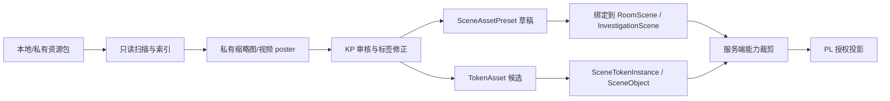

# 《沉没之城》VTT 架构映射方案

## 结论摘要

《沉没之城》不应复刻 Foundry，而应吸收 Foundry 的 system/package 思路、Owlbear 的轻量地图体验、PlanarAlly 的 Web 地图对象模型、AboveVTT 的外部内容整合方法，建设适合中文网团和 COC 调查的素材化场景系统。

第一轮决策是：把“VTT 能力”做成当前房间调查体验的可选视觉层，而不是新建一个取代房间日志、线索板、NPC 档案、调查坞和移动/桌面边界的战棋平台。KP 的核心工作流应是先把本地/私有素材包扫描成可审核索引，再选择背景、点位和 Token 绑定到 `RoomScene` 或调查场景，最后把已授权、已公开的视觉投影下发给 PL。PL 看到的是当前调查场景、公开点位、公开 NPC/Token 和摘要；KP 额外看到私密点位、KP 备注、未公开素材和审核状态。

当前工程已经具备房间、角色、骰点、叙事场景、调查线索/NPC/场景、日志、KP 私密便签与能力门禁，但没有生产级的素材目录、`TokenAsset`、`SceneObject` / `SceneTokenInstance` 场景对象层、资源包只读导入器或 `RuleSystemManifest`/registry 模型。因此本方案只给出概念边界和开发拆分；精确 Prisma 字段、API 契约、权限裁剪和前端组件形态应进入后续实现计划。

## 用户与 KP 工作流

1. KP 在本机或私有存储中选择 FVTT/Roll20/普通素材目录。
2. 系统只读扫描并生成私有资产索引、缩略图/poster、来源包记录和候选标签。
3. KP 在审核队列里确认哪些资源可用于本房间，修正分类、可见性和来源备注。
4. KP 以已审核地图/动态背景创建场景预设，补充公开摘要、KP 私密备注、点位和 Token 草稿。
5. KP 将场景预设绑定到现有 `RoomScene` 或调查场景，并把点位关联到 `InvestigationClue`、`InvestigationNpc`、`InvestigationScene`、`RoomNpc` 或角色。
6. 房间运行时服务端按成员能力裁剪数据：KP 收到完整场景对象，PL 只收到公开摘要、公开点位、公开 Token 和可见背景。
7. PL 仍通过现有聊天、线索板、NPC 档案、调查坞、报告归档和投骰历史推进游戏；视觉场景只是帮助理解空间和气氛。

简化数据流：

## 第一轮 MVP

- 本地资源扫描。
- 私有素材库索引。
- 静态/动态地图绑定到 RoomScene。
- NPC/角色与 TokenAsset 绑定。
- 场景点位标记。
- KP 私密点位和 PL 可见摘要。
- `RuleSystemManifest` 草案落文档，不立即开发完整 DND5E。

MVP 的产品定义是“COC 调查场景板”。第一版必须围绕私有资产索引、静态/动态 `RoomScene` 背景、marker 点位、KP 私密 notes、PL-visible summary、TokenAsset 实体绑定和显式 visibility 展开。现有房间日志、线索板、NPC 档案、调查 dock、移动端/桌面端边界继续权威；视觉场景不得替换它们，也不得新增 AI 面板。

### MVP 切片与验收

| 切片 | 验收标准 | 非目标 |
| --- | --- | --- |
| 素材资产库 V1 | KP 能指定允许的私有根目录；扫描结果保留来源、hash、尺寸/时长、缩略图/poster、失败记录；商业资源不进入公网静态目录 | 不自动解压归档、不抓远程 URL、不做版权判断、不公开市场 |
| 场景背景与点位 V1 | KP 能把已审核图片/视频作为场景背景；能创建 marker，配置公开摘要、KP 私密备注和 visibility；PL 只看到可见对象 | 不做动态光照、墙体视线、碰撞、测距、完整 fog vision |
| Token 绑定 V1 | `TokenAsset` 作为素材项复用；场景实例可绑定 character、investigationNpc、roomNpc 或 custom；删除实例不删除素材或业务实体 | 不做 HP 条、占格、敌我规则、动画状态机、战斗轮自动绑定 |
| 规则 manifest/registry V1 | 文档明确 `coc7` 默认规则、`dnd5e`/`custom` 预留、能力声明和内容包边界；业务代码仍不启用完整 DND5E 自动化 | 不实现职业、法术、等级成长、完整战斗自动化 |
| 只读 pack adapter V1 | 能识别 FVTT manifest 候选和常见媒体格式；Roll20 只按真实样本前的目录/文件名约定进入候选；KP 审核后才可绑定 | 不复制 AGPL/GPL 代码、不解析未验证专有格式、不执行第三方脚本 |

## 当前状态映射

| 现有模型/组件 | 保留权威 | 可选扩展 | 原因 |
| --- | --- | --- | --- |
| `Room` | 房间身份、成员、当前阶段/场景、调查对象、日志与能力边界继续权威 | 未来可通过可选字段/关系指向默认场景视觉层或规则启用策略 | `Room` 已关联 `RoomScene`、`ScenePreset`、`RoomEventLog`、调查线索/NPC/场景、KP 便签等，不需要被 VTT 场景替换 |
| `RoomScene` | 叙事场景继续是房间内“当前场景”的基础对象；现有必需 `roomId`、`phaseId`、`sortOrder` 和关联关系继续保留 | 可选绑定背景资产、`SceneObject` / `SceneTokenInstance` 集合、坐标模式、视觉预设 | `title` / `description` / `atmosphere` / `imageUrl` / `musicUrl` / `status` 是本轮最相关的叙事/视觉字段子集，但 `RoomScene` 还承担房间、阶段、排序和关联约束，不能被简化成纯视觉表 |
| `InvestigationScene` | 调查地点/场景的公开摘要、KP 备注、氛围、imageUrl、当前状态继续可用 | 可与 `RoomScene` 视觉层互相引用，或作为 marker payload 的业务对象 | 它已经有 publicSummary、keeperNotes、imageUrl、isCurrent，不应被地图对象复制正文 |
| `InvestigationClue` | 线索内容、状态、visibility、NPC/scene 引用继续权威 | marker 只引用 clueId，并显示公开标题/摘要 | 现有 clue 支持 KP_ONLY/PUBLIC 与 reveal 流程；地图点位不能绕过此权限 |
| `InvestigationNpc` | NPC 公开档案、KP notes、状态和 visibility 继续权威 | `TokenAsset` 可提供头像之外的 token/立绘/状态变体 | NPC 不是 Token；Token 只是视觉表现 |
| `KpPrivateNote` | KP 私密便签继续只在 KP 工具中管理 | 可被私密 marker 引用或作为 marker payload 的关联对象 | 保持 KP 私密层，不让 PL 视觉投影泄漏 |
| `RoomMessage` / `DiceRoll` / `RoomLog` | 聊天、投骰、日志与归档继续是跑团记录权威 | 场景交互可追加事件或引用关键骰点，但不替代现有日志 | 当前已有消息、暗骰/可见用户、RoomLogEvent/Export 等结构 |
| `RoomMember` / `Character` / `RoomCharacterLock` | 玩家、角色绑定和跑团生命周期继续权威 | `SceneTokenInstance.boundEntity` 可引用角色或成员展示角色 | Token 绑定不改变角色卡、HP/SAN、锁定或结算 |
| `ScenarioAsset` / `AiAsset` | 可作为已有资产思路参考，但不是 VTT 私有素材库 | 新资产目录应独立支持私有来源、hash、缩略图、审核状态和商业授权备注 | `ScenarioAsset` 偏剧本生成图；`AiAsset` 偏 AI 生成资产，不等于 FVTT/Roll20 私有包索引 |
| `ScenePanel` | 继续管理调查场景 title/publicSummary/keeperNotes/imageUrl/isCurrent | 后续可打开“视觉层编辑”入口，但不在第一版直接塞入完整地图编辑器 | 当前组件已可新增/编辑/设当前场景，适合连接轻量视觉预设 |
| `RoomSceneBanner` | 继续显示当前场景叙事摘要 | 后续可在 banner 下展示已授权背景缩略图或进入场景板 | 当前 banner 以当前场景/阶段描述为主，不应变成重型地图 |
| `InvestigationDock` | 继续作为调查档案入口，包含焦点、准备、线索、NPC、场景、日志、KP 便签 | 场景视觉层应从 scenes tab 或场景详情进入 | Dock 已按 capabilities 裁剪 KP-only tab，是新能力最自然的入口 |
| `RoomCommandRail` | 继续是桌面 KP 工具台与快捷入口 | “调整场景”可打开场景板，但仍走调查 dock 和能力门禁 | 当前 rail 已分成员、场景、线索、NPC、战斗、结算、投骰等入口 |
| `RoomPlayerView` | 继续保留 PL 视图的聊天、场景 banner、快捷检定、线索概览和移动端状态条 | 仅显示授权后的场景投影，不显示 KP 编辑器、不显示 AI 面板 | 移动端/桌面布局已被定版维护，视觉层应低侵入 |
| `RoomGameplayTypes` | 继续作为房间页前端 view-model 的边界 | 后续新增视觉层 view-model 应以可选字段进入，不破坏现有 `currentScene`/`members`/`rollData` | 现有类型已包含 room capabilities、currentScene、character、rollData 和 combat state |
| `docs/EXTENSIBILITY.md` | 保留“规则注册、存储抽象、消息持久化、模板化”的方向价值 | `Plugin`/`RoomPlugin`/`CustomField` 和直接开发 `dnd5e.ts` 的步骤需视为旧草案，不作为当前 MVP 实现指令 | 该文档提出的问题仍准，但数据库片段和优先级已落后于当前房间/调查模型 |

## 有界子系统

### 1. 私有导入与索引

职责是只读扫描、识别 FVTT manifest 候选、识别 Roll20/普通资源目录、提取媒体 metadata、生成 hash、缩略图/poster 和失败记录。它不移动源文件、不执行包内代码、不自动发布到房间、不把商业资源复制到 `apps/web/public`。

概念实体：

- `AssetSourceRoot`：用户授权的扫描根。
- `ImportedAsset`：私有媒体索引项，保存相对来源、hash、mime、尺寸/时长、来源包、licenseNote、审核状态。
- `SourcePack`：FVTT/Roll20/普通目录的包级索引。
- `AssetReviewDraft`：等待 KP 审核的候选分类和绑定草稿。

精确数据库表、文件存储路径和 API 返回形状留给实现计划。

### 2. 资产目录

职责是把已审核媒体变成可复用资产，而不是直接暴露本机路径。地图、动态背景、marker 图标、Token 图、音频/视频 poster 都应通过资产目录查找和授权。

概念实体：

- `AssetCatalogItem`：统一资产条目。
- `SceneBackgroundAsset`：地图/动态背景/氛围视频的业务分类。
- `TokenAsset`：角色/NPC/怪物/物件/marker 的可复用视觉素材。
- `AssetTag` / `AssetCollection`：检索与分组。

### 3. 场景组合

职责是把资产目录组合成某个场景的视觉预设：背景、overlay、markers、tokens、KP notes 和可选手动遮罩。它只保存引用和轻量展示参数，不复制线索正文、NPC 档案或规则文本。

概念实体：

- `SceneAssetPreset`：可复用预设，来自 KP 手工创建或资源包草稿。
- `SceneObjectDraft`：preset/import 阶段的 marker/token/note/fog 草稿对象。
- `SceneObject`：如果后续实现需要 generic object 层，用于持久化 marker/note/fog 对象，并绑定到 `RoomScene` 或 `InvestigationScene`。
- `SceneTokenInstance`：token 专用摆放实例，绑定 `TokenAsset`，并可选绑定 character、`investigationNpc`、`roomNpc` 或 `custom`。
- `coordinateMode`：归一化坐标或背景像素坐标，具体方案留待实现决策。

### 4. 房间运行投影

职责是在房间运行时把完整 KP 场景裁剪成 PL 可见投影。可见性必须在服务端/接口层完成，前端隐藏不是权限边界。

概念规则：

- `keeper`：仅 KP 可见。
- `players`：当前房间玩家可见。
- `public`：房间外预览或模板展示候选，运行中默认谨慎使用。

现有 `KP_ONLY` / `PUBLIC` 调查 visibility 可以继续保留；VTT 视觉层是否使用三档命名或映射到现有两档，是实现计划要解决的兼容问题。

### 5. Token/实体绑定

职责是让 Token 表示“谁以什么视觉形象出现在场景哪里”，而不是让 Token 成为角色卡、NPC 档案或战斗单位本身。

概念关系：

- 一个 `TokenAsset` 可被多个场景实例复用。
- 一个场景实例最多绑定一个领域实体：`character`、`investigationNpc`、`roomNpc` 或 `custom`。
- 一个 NPC/角色可有多个视觉槽位：头像、立绘、静态 token、动态 token、状态变体。
- 删除场景实例不删除 `TokenAsset`，也不删除角色、NPC 或线索。

### 6. 规则 registry

职责是把 Foundry system/package 思路文档化为受控规则生命周期边界。第一阶段只落 `RuleSystemManifest` 与 registry 草案，不开发完整 DND5E 自动化。

概念职责：

- 默认内置 `coc7`。
- 预留 `dnd5e` / `custom` manifest。
- 声明 dice、successLevel、characterSheetSchema、combat、advancement 等能力。
- 内容包只提供数据和索引；规则包解释数据；插件/内容包不得直接迁移主数据库。

## 后续开发拆分

1. 素材资产库 V1。
2. 场景背景与点位 V1。
3. Token 绑定 V1。
4. 规则系统 manifest 与 registry V1。
5. FVTT/Roll20 资源包只读导入器 V1。

执行顺序应按依赖展开：

1. **资产目录基础先行**：没有私有资产索引、hash、缩略图和权限代理，场景背景与 Token 都会退回散落 URL，商业资产也难以保护。
2. **场景背景/markers 第二**：背景和点位是 COC 调查价值最高、复杂度最低的体验切片，能复用现有 `ScenePanel`、`RoomSceneBanner` 和 `InvestigationDock`。
3. **Token 绑定第三**：Token 依赖资产目录与场景对象坐标，且必须先明确不写回 HP/SAN/战斗规则。
4. **规则 manifest/registry 第四**：先把 `coc7` 能力集中和 `dnd5e` 延后边界写清楚，避免第一版被多规则自动化拖大。
5. **只读 pack adapter 第五**：导入器依赖资产目录、场景预设和 Token 候选；Roll20 样本、视频代理和存储位置也需要前置决策。

## 暂不实现

- 动态光照。
- 墙体视线。
- 复杂碰撞。
- 完整战斗自动化。
- 3D 地图编辑器。
- 公开资源市场。

额外明确非目标：

- 不克隆 Foundry、PlanarAlly、Owlbear 或 AboveVTT 的产品形态。
- 不复制 AGPL/GPL 源码、字段实现或 UI 逻辑。
- 不把商业地图、Token、规则书文本或派生缩略图公开托管。
- 不在房间页新增 AI 面板，不把 AI 资产工坊混入本轮 VTT MVP。
- 不改变现有移动端/桌面端房间边界。
- 不让插件或内容包控制 Prisma schema migration。

## 风险

- 商业资源版权风险：默认私有访问，所有原图、缩略图、poster、视频代理都走鉴权，不进入公网静态目录。
- AGPL/GPL 源码污染风险：只研究架构，不复制代码。
- 功能膨胀风险：先做 COC 调查场景，不做 DND 战棋平台。
- 性能风险：动态地图视频需要缩略图、懒加载和移动端降级。
- 权限泄漏风险：KP-only 点位、未公开 NPC、私有素材路径必须在服务端裁剪；前端条件渲染不能作为安全边界。
- 模型耦合风险：Token 如果直接写回角色/NPC/战斗状态，会破坏当前房间生命周期和结算边界。
- 旧草案误用风险：`docs/EXTENSIBILITY.md` 中的 Prisma 片段是方向性草案，不等于当前数据库事实。

## 迁移与兼容 stance

- 所有 VTT 能力应以 additive optional fields/relations 进入；没有 VTT 数据的现有房间必须照常运行。
- `RoomScene`、`InvestigationScene`、`InvestigationClue`、`InvestigationNpc`、`RoomMessage`、`DiceRoll`、`RoomLog` 的现有语义不迁移、不替换。
- 旧 `sceneDesc`、`imageUrl`、`publicSummary`、`keeperNotes` 可以作为第一版数据迁移/回填的来源，但不应被强制清空或改写。
- 规则包、内容包、资源包不得直接控制 Prisma schema migration；需要新表/字段时必须由主项目实现计划、迁移脚本和人工审核完成。
- 服务器部署若引入私有素材目录，应先确定备份、容量、鉴权、日志脱敏和静态缓存策略。
- 前端 view-model 新增视觉层时应保持可选；`RoomGameplayTypes` 的现有 `currentScene`、`members`、`rollData`、`myCapabilities` 等契约继续可用。

## `docs/EXTENSIBILITY.md` 复用与过期点

仍可复用：

- “规则逻辑不应散落在投骰/角色卡/房间组件里”的问题判断。
- `RuleRegistry` 作为规则能力入口的方向。
- 存储抽象、文件/资源管理、消息持久化、角色模板等长期扩展方向。
- 新功能要考虑 REST、分页/过滤、Socket 向后兼容、移动端适配、类型定义的检查清单。

已经过期或不能直接照搬：

- `Plugin`、`RoomPlugin`、`CustomField` 的 Prisma 片段没有出现在当前 schema 中，不能当成已实现模型。
- `Room.ruleId`、`DiceRoll.ruleId` 也未出现在当前 schema 中，不能在本方案声称已有。
- “创建 `rules/dnd5e.ts`”的步骤与本轮边界冲突；DND5E 自动化明确延后。
- “文件上传”草案的 `Asset` 表不能覆盖当前 VTT 私有素材库需求，因为它缺少来源包、hash、缩略图、审核状态、商业访问和代理语义。
- 消息持久化问题已经部分被当前 `RoomMessage`、`RoomLog`、`RoomLogEvent`、导出模型改变，旧文档“消息只在内存/WebSocket”不再准确。

## 开放决策

- 规则启用维度：per-room 还是 per-scenario。当前旧草案偏 `Room.ruleId`，但 VTT 场景预设也可能需要 per-scenario 标注，需实现前定案。
- 坐标系统：归一化坐标还是背景像素坐标。归一化更适配响应式，像素坐标更贴近素材原始尺寸；第一版只能选一个并写入 metadata。
- `public` 可见性的产品含义：是“房间内公开给 PL”，还是“房间外访客/模板预览也可见”。建议运行中先映射为玩家可见，房间外 public 另设显式开关。
- 私有存储位置：本机索引、服务器私有目录、对象存储还是混合模式。需要同时决定备份、容量和日志脱敏。
- Roll20 样本检查：只有拿到 1-2 个真实 Roll20 包/目录后，才决定是否支持专有 metadata 或导入约定。
- 视频代理选择：直接私有 range proxy、生成 poster 后按需播放、还是转码缓存。移动端默认需要 poster fallback。
- 手动 fog 是否进入 MVP：它有调查价值，但不是背景/marker/token 主流程的前置依赖。

## 证据索引

| 证据 | 路径 | 行号/稳定名称 | 用途 |
| --- | --- | --- | --- |
| 工作树路径重写要求 | `.superpowers/sdd/task-6-brief.md` | Task 6 brief | 本任务所有路径均落在 `C:\Users\29102\Documents\沉没之城\.worktrees\vtt-architecture-research` |
| VTT 研究目录 | `docs/superpowers/research/vtt-architecture/README.zh-CN.md` | stable file | 说明前序报告 01-04 的产物位置 |
| Foundry system/package 结论 | `docs/superpowers/research/vtt-architecture/01-rule-extension.zh-CN.md` | `RuleSystemManifest`, `RuleRegistry` | 借鉴 manifest、registry、内容包边界，不开发完整 DND5E |
| 地图轻量化结论 | `docs/superpowers/research/vtt-architecture/02-map-scene.zh-CN.md` | `SceneAssetPreset`, `SceneObjectDraft` | 借鉴背景、markers、tokens、KP notes 和可见性，不做墙体/光照 |
| Token/资产结论 | `docs/superpowers/research/vtt-architecture/03-token-asset.zh-CN.md` | `TokenAsset`, `SceneTokenInstance` | TokenAsset 与场景实例分离，实体绑定不等于规则自动化 |
| 私有导入结论 | `docs/superpowers/research/vtt-architecture/04-resource-pack-import.zh-CN.md` | `ImportedAsset`, 私有导入流水线 | 商业资源私有索引、KP 审核、只读导入器 |
| `Room` 当前关系 | `apps/server/prisma/schema.prisma` | `model Room`, lines 197-245 | 房间已关联场景、预设、日志、调查对象、KP notes |
| 角色模型 | `apps/server/prisma/schema.prisma` | `model Character`, lines 93-163 | 角色卡和角色资产槽位应保留为领域实体，不等同 Token |
| 跑团生命周期/角色锁 | `apps/server/prisma/schema.prisma` | `RoomRun`, `RoomRunParticipant`, `RoomCharacterLock`, lines 262-330 | Token 不应改写生命周期、角色锁和结算 |
| 调查线索/NPC/场景 | `apps/server/prisma/schema.prisma` | `InvestigationClue`, `InvestigationNpc`, `InvestigationScene`, lines 359-418 | VTT marker 应引用现有调查对象并尊重 visibility |
| 调查日志/KP notes | `apps/server/prisma/schema.prisma` | `InvestigationLogEntry`, `KpPrivateNote`, lines 420-451 | 关键消息、关键骰点和 KP 私密层已有模型 |
| 房间消息/骰点 | `apps/server/prisma/schema.prisma` | `RoomMessage`, `DiceRoll`, lines 870-906 | 跑团记录与暗骰/可见用户继续权威 |
| 叙事场景/预设/事件日志 | `apps/server/prisma/schema.prisma` | `RoomScene`, `RoomEventLog`, `ScenePreset`, lines 977-1089 | 可作为视觉层可选挂点，但不是完整地图对象模型 |
| 房间日志 | `apps/server/prisma/schema.prisma` | `RoomLog`, `RoomLogEvent`, `RoomLogExport`, lines 1103-1158 | 视觉交互不替代日志归档 |
| 临时 NPC | `apps/server/prisma/schema.prisma` | `RoomNpc`, lines 1283-1302 | Token 可绑定 roomNpc，但不复制 NPC 档案 |
| 现有资产类参考 | `apps/server/prisma/schema.prisma` | `AiAsset`, lines 813-843; `ScenarioAsset`, lines 1884-1901 | 当前资产模型不是 VTT 私有素材库 |
| 调查前端契约 | `apps/web/src/types/investigation-contract.ts` | `InvestigationVisibility`, `InvestigationSceneView`, lines 1-48 | 当前前端只表达 KP_ONLY/PUBLIC 与调查场景摘要 |
| 调查服务端 API 前端入口 | `apps/web/src/services/investigation.service.ts` | scene/clue/npc/timeline/kp-notes functions, lines 22-205 | VTT UI 应接入现有调查服务边界，而不是绕开 |
| 场景编辑面板 | `apps/web/src/pages/rooms/components/ScenePanel.tsx` | `ScenePanel`, lines 64-220 | 当前可管理调查场景、公开摘要、KP notes、imageUrl |
| 当前场景横幅 | `apps/web/src/pages/rooms/components/RoomSceneBanner.tsx` | `RoomSceneBanner`, lines 14-70 | 继续显示叙事场景，不变成重型地图 |
| 调查坞 | `apps/web/src/pages/rooms/components/InvestigationDock.tsx` | `InvestigationDock`, lines 13-95 | 现有 tabs 与 capabilities 已覆盖场景/线索/NPC/KP notes |
| 桌面工具台 | `apps/web/src/pages/rooms/components/RoomCommandRail.tsx` | `RoomCommandRail`, lines 33-305 | 现有场景、线索、NPC、投骰、报告入口继续权威 |
| 玩家视图 | `apps/web/src/pages/rooms/components/RoomPlayerView.tsx` | `RoomPlayerView`, lines 41-84, 320-590 | PL 视图保留聊天、场景 banner、快捷检定、线索概览 |
| 房间 view-model | `apps/web/src/pages/rooms/components/RoomGameplayTypes.ts` | `RoomGameplayRoom`, `RoomGameplayMember`, `RoomChatMessage`, `RoomCombatState` | VTT 投影应以可选 view-model 扩展，不破坏现有类型 |
| 旧扩展性文档 | `docs/EXTENSIBILITY.md` | lines 9-132, 136-185, 317-363 | 方向可复用，模型片段与 DND5E 实施步骤需更新 |
